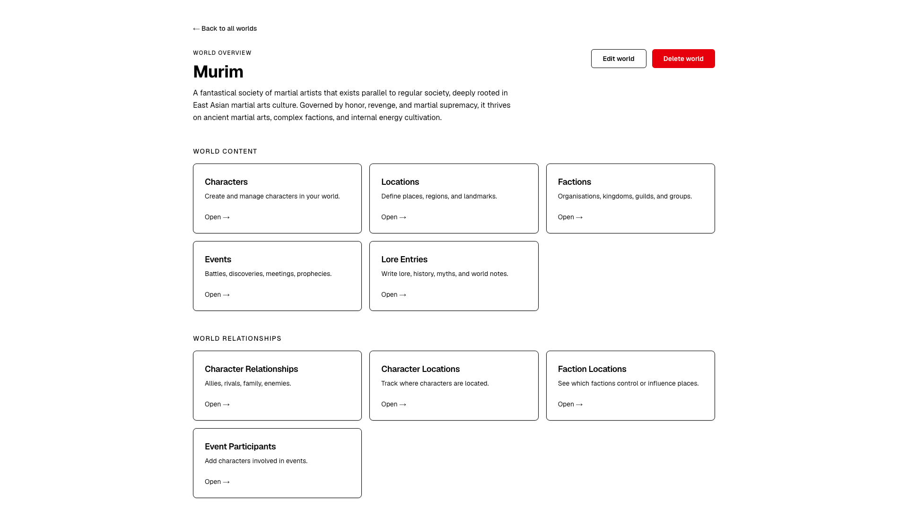

# World Builder

A full‑stack application that helps writers organise the worlds, characters, lore, and relationships in their stories or novels.  
Built with **Java (Spring Boot)**, **PostgreSQL**, **Next.js**, and **TypeScript**.

MVP Front-end view



---

## 🚀 Features

- Create and manage worlds, characters, locations, factions, events, and lore  
- Define relationships between characters, factions, and events  
- Secure backend with Spring Security (JWT authentication)  
- Fully typed frontend using Next.js + TypeScript  
- PostgreSQL schema managed with Flyway migrations  
- Dockerised local development environment  
- Deployed backend on Render and frontend on Vercel

---

## 🛠 Tech Stack

### **Backend**
- Java 21  
- Spring Boot  
- Spring Security (JWT)  
- PostgreSQL  
- Flyway  
- Maven  
- Docker  

### **Frontend**
- Next.js  
- TypeScript  
- shadcn/ui (Radix + Tailwind components)
- Tailwind CSS  
- Node.js 22.21.1  

---

## 📦 Local Development

### **Prerequisites**
- Java 21  
- Node.js 22.21.1  
- Docker  
- Maven  

---

## 🗄️ Database (PostgreSQL via Docker Compose)

Start PostgreSQL locally using Docker Compose:

```bash
  docker compose up -d
